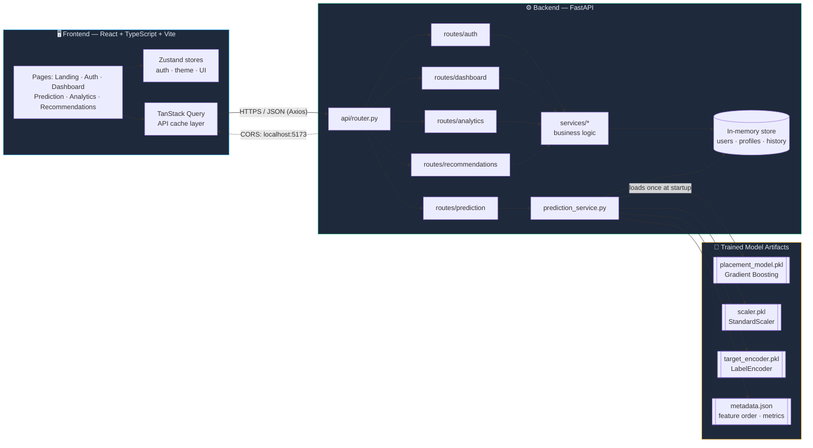
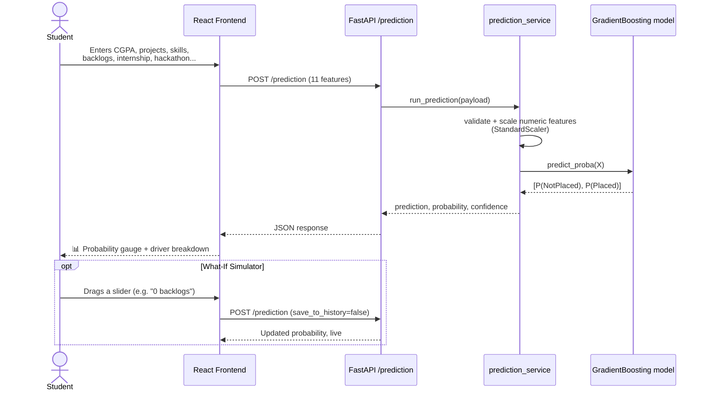
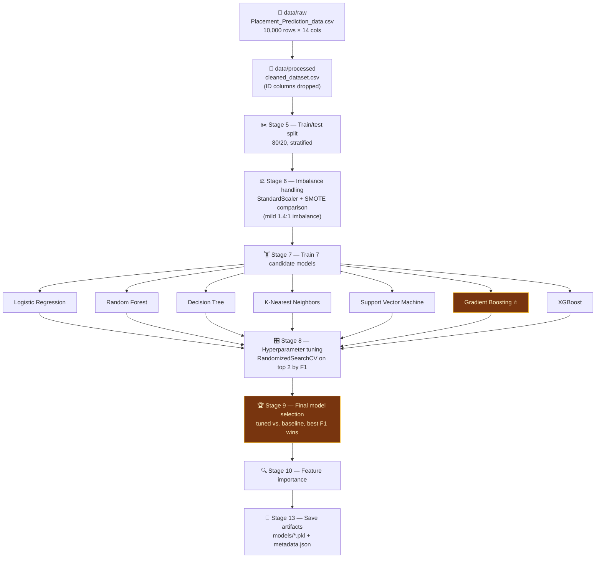
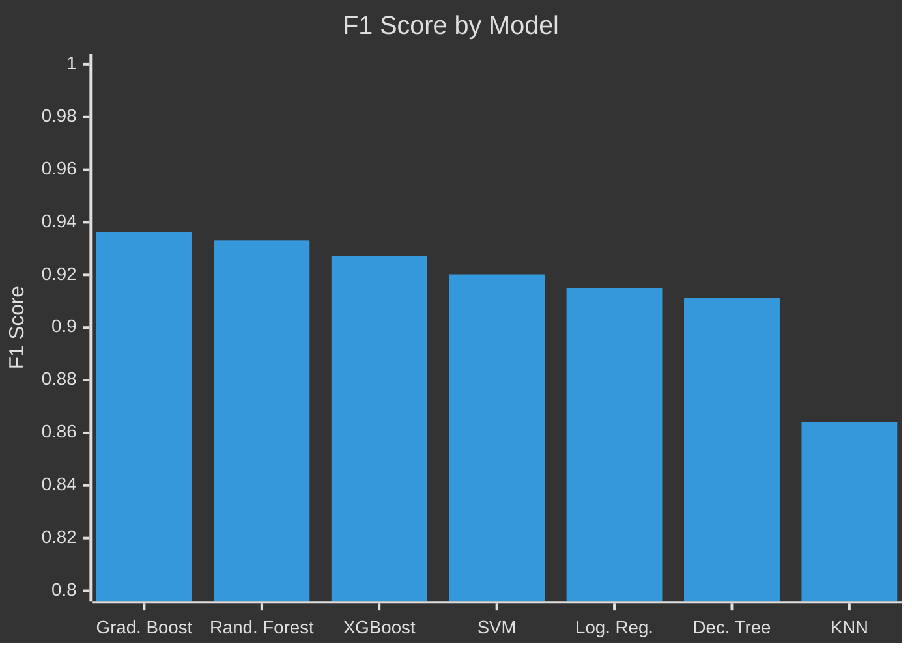
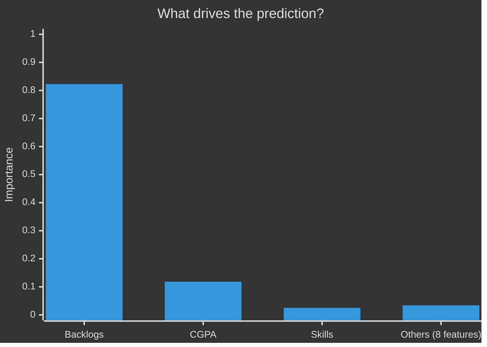

# 🎓 PlacementAI — Student Placement Prediction Platform

> AI-powered career intelligence for students: a real, trained ML model predicts placement probability from academic and activity data, wrapped in a full product — dashboard, analytics, resume tools, interview prep, and a recommendation engine.

<p align="left">
  
  
  
  
</p>

<p align="left">
  
  
  
  
  
  
  
</p>

---

## 📌 What is this?

**PlacementAI** answers one question for a student — *"How likely am I to get placed?"* — with a real, benchmarked machine-learning model, and then builds an entire career-readiness product around that answer: dashboards, what-if simulation, skill-gap recommendations, resume tooling, and interview prep.

- 🎯 **The prediction is real.** A Gradient Boosting classifier trained on 10,000 student records, benchmarked against 6 other algorithms, drives every probability shown in the app.
- 🖥️ **The product is real too.** A FastAPI backend exposes it (plus auth, dashboard, analytics, recommendations) to a full React + TypeScript single-page app.
- 🔬 **Two ways to use it** — the full platform, or a minimal legacy Flask + HTML demo for a quick sanity check of the model alone.

---

## 🧭 Table of contents

- [Live features](#-live-features)
- [System architecture](#-system-architecture)
- [How a prediction happens](#-how-a-prediction-happens)
- [The ML pipeline](#-the-ml-pipeline)
- [The model, in numbers](#-the-model-in-numbers)
- [Repository layout](#-repository-layout)
- [Getting started](#-getting-started)
- [Tech stack](#-tech-stack)
- [Notes & limitations](#-notes--limitations)

---

## ✨ Live features

| Feature | What it does |
|---|---|
| 🏠 **Landing page** | Marketing site introducing the product |
| 🔐 **Auth** | Email/password signup & login, Google OAuth, GitHub account linking |
| 📊 **Dashboard** | Placement readiness snapshot at a glance |
| 🔮 **Prediction** | Runs the real trained model against your profile — probability, driver breakdown, and an interactive **What-If Simulator** to explore how CGPA, projects, skills, backlogs, etc. move the odds |
| 📈 **Analytics** | Trends and breakdowns over your profile history |
| 🧩 **Recommendations** | Company matches and skill-gap guidance |
| 📄 **Resume, Interview Prep, Leaderboard, Profile, Settings** | Supporting career tools around the core prediction |

---

## 🏗️ System architecture



---

## 🔄 How a prediction happens



---

## 🧪 The ML pipeline

`train.py` runs a full, staged pipeline from raw CSV to saved model artifacts:



**Winner: Gradient Boosting (baseline, untuned)** — it outperformed every tuned variant, including its own tuned version.

---

## 📊 The model, in numbers

<table>
<tr>
<td width="50%" valign="top">

### Test-set performance

| Metric | Score |
|---|---|
| **Accuracy** | 94.65% |
| **Precision** | 93.47% |
| **Recall** | 93.80% |
| **F1 Score** | 93.63% |
| **ROC-AUC** | 99.05% |
| **Overfit gap** (train − test) | 0.0008 (negligible) |

### Dataset balance

- 10,000 students total
- 4,197 **Placed** (42%)
- 5,803 **Not Placed** (58%)

</td>
<td width="50%" valign="top">

### Model comparison (F1 score)



### Feature importance



</td>
</tr>
</table>

> 🔑 **`backlogs` dominates** the model's decision-making — by far the strongest predictor. Students with fewer backlogs and higher CGPA show substantially higher placement probability in this dataset.

### Confusion matrix (test set, n = 2,000)

|  | Predicted: Not Placed | Predicted: Placed |
|---|---|---|
| **Actual: Not Placed** | ✅ 1,106 | ❌ 55 |
| **Actual: Placed** | ❌ 52 | ✅ 787 |

### Input features (11)

`CGPA` · `Major Projects` · `Workshops/Certifications` · `Mini Projects` · `Skills` · `Communication Skill Rating` · `12th Percentage` · `10th Percentage` · `Backlogs` · `Internship (Yes/No)` · `Hackathon (Yes/No)`

---

## 📁 Repository layout

```
placement final/
├── backend/                      FastAPI application (the real API layer)
│   ├── main.py                    app entrypoint, CORS, startup hooks
│   ├── config.py                   env-driven settings (Pydantic)
│   └── app/
│       ├── api/router.py            aggregates all domain routers
│       ├── routes/                   auth · prediction · dashboard · analytics
│       │                             recommendations · resume · profile
│       │                             settings · onboarding · integrations
│       ├── services/                  business logic, incl. prediction_service
│       │                             (loads the trained model)
│       ├── auth/                       JWT + Google/GitHub OAuth
│       ├── models/                      in-memory data store
│       └── schemas/                      Pydantic request/response models
│
├── frontend/                     React + TypeScript + Vite SPA
│   └── src/
│       ├── pages/                  landing, auth, and /app/* pages
│       ├── layouts/                 MarketingLayout, AppShell
│       ├── components/               UI primitives, nav, charts, motion/3D
│       ├── stores/                    Zustand (auth, theme, UI)
│       └── lib/                        Axios API client, React Query setup
│
├── data/
│   ├── raw/Placement_Prediction_data.csv       original dataset (10,000 × 14)
│   └── processed/cleaned_dataset.csv            cleaned (ID columns dropped)
├── models/
│   ├── placement_model.pkl                      trained Gradient Boosting classifier
│   ├── scaler.pkl                                 StandardScaler for numeric features
│   ├── target_encoder.pkl                          LabelEncoder for PlacementStatus
│   └── metadata.json                                feature order, metrics, importances
├── notebooks/                                    EDA plots (PNG)
├── train.py                                      model training, tuning, selection, saving
├── predict.py                                    standalone prediction helper
├── app.py                                        legacy Flask demo (no auth/API)
└── requirements.txt                              root Python deps
```

---

## 🚀 Getting started

**Two ways to run the prediction model:**

1. **Full platform** (recommended) — FastAPI backend + React frontend
2. **Legacy standalone demo** — a minimal Flask app with a single HTML form, useful for a quick sanity check of the model alone

### 1️⃣ Backend (FastAPI)

```bash
cd backend
python -m venv venv
venv\Scripts\activate          # Windows
# source venv/bin/activate     # macOS/Linux
pip install -r requirements.txt

copy .env.example .env         # Windows — cp on macOS/Linux
# fill in OAuth credentials if you want Google/GitHub login;
# everything else works with the defaults

uvicorn main:app --reload --port 8000
```

API docs available at `http://127.0.0.1:8000/docs` once running.

### 2️⃣ Frontend (React + Vite)

```bash
cd frontend
npm install

copy .env.example .env         # Windows — cp on macOS/Linux
# VITE_API_BASE_URL should point at the backend (default http://127.0.0.1:8000)

npm run dev
```

Open `http://localhost:5173`.

> ⚠️ **Port matters:** OAuth redirect URIs and backend CORS are configured for `http://localhost:5173`. Running the frontend on a different port will break login until you update `CORS_ORIGINS` in `backend/.env` to match.

**Demo login:** `demo@example.com` / `password123` (seeded automatically on backend startup, with a demo prediction already in its history).

### 3️⃣ (Optional) Retrain the model

```bash
pip install -r requirements.txt   # root requirements — training deps
python train.py
```

Regenerates the artifacts in `models/`.

### 🩹 Legacy standalone demo

```bash
pip install -r requirements.txt
python app.py
```

Open `http://127.0.0.1:5000`, fill in the form, and click **Predict Placement**.

---

## 🛠️ Tech stack

| Layer | Stack |
|---|---|
| **ML** | scikit-learn · pandas · numpy · imbalanced-learn (SMOTE) · XGBoost · joblib |
| **Backend API** | FastAPI · Pydantic · python-jose (JWT) · Google/GitHub OAuth |
| **Frontend** | React 18 · TypeScript · Vite · Tailwind CSS · React Router · TanStack Query · Zustand · React Hook Form + Zod |
| **Motion/3D** | Framer Motion · GSAP · React Three Fiber |
| **Charts** | Recharts |

---

## 📝 Notes & limitations

- The backend's analytics and recommendations endpoints currently return data backed by an **in-memory store** — it resets on every server restart. Swap in a real database before deploying.
- Google/GitHub OAuth are optional: without credentials in `backend/.env`, every other endpoint works normally and only the OAuth-specific routes return `503`.
- `POST /prediction` always runs the *real* trained model — nothing about the ML path is mocked, even in demo mode.
